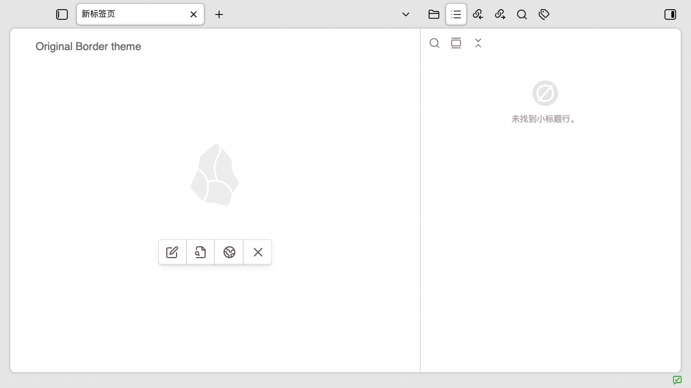
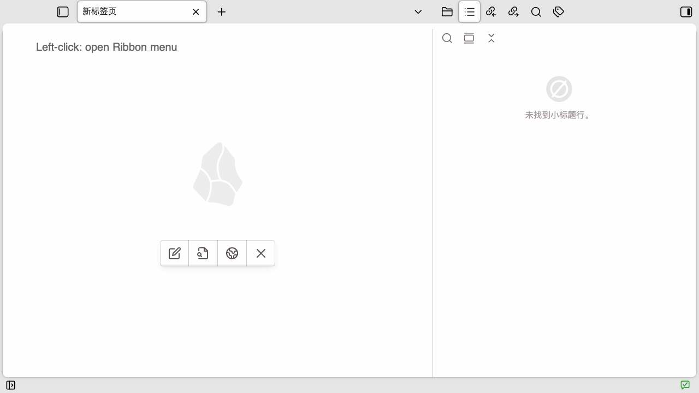

# Border Theme Compacted

[English](README.md) | 简体中文

一个仅针对 Obsidian [Border 主题](https://github.com/Akifyss/obsidian-border)的轻量桌面插件。它将紧凑界面样式和 Ribbon 上拉菜单整合在一起，不需要单独启用 CSS snippet。

## 效果演示

### 1. Border 原始界面与紧凑布局对比



两张图片每约 2 秒轮换一次，分别展示 Border 原始布局和启用插件后的紧凑布局。

### 2. Ribbon 功能演示



动画依次展示：左键打开 Ribbon 上拉菜单、菜单内容、右键显示紧凑版原 Ribbon，以及再次右键隐藏原 Ribbon。

## 功能

- 将工作区外侧留白从约 16px 缩小到 4px。
- 使用 36px 标题栏网格和 32px TAB、按钮。
- 对齐主内容区 TAB、侧栏 TAB、侧栏收展按钮、标签列表和新建标签页按钮。
- 将原生窗口按钮与 36px 紧凑标题栏对齐：Windows 控件高度设为 36px，macOS traffic-light 垂直居中。
- 将展开后的原 Ribbon 缩小为 36px，功能按钮为 32px。
- 避免显示或隐藏 Ribbon 时短暂出现 Border 阴影边框。
- 防止拖拽主内容区或侧栏 TAB 后整排按钮上移。
- 在左下角状态栏提供一个 24px 的 Ribbon 功能按钮。
- 以上拉滚动列表展示当前可见的 Ribbon 项目。
- 右键状态栏按钮显示或隐藏 Obsidian 原 Ribbon。

## 主题判断

插件运行时检查：

```js
this.app.customCss?.theme === "Border";
```

只有当前社区主题为 `Border` 时，插件才会为 `body` 添加 `border-theme-compacted-theme` class。`styles.css` 中的界面覆盖全部限定在该 class 下。

切换到其他主题后，插件会移除 class、关闭上拉菜单、隐藏状态栏按钮，并恢复目标主题自己的布局。

在 macOS 上，插件仅在 Border 生效时临时调整 Electron 原生 traffic-light 的 Y 坐标，切换主题或卸载插件时恢复原位置。Windows 的对应垂直对齐完全由限定在 Border 主题下的 CSS 完成，同时保留 Border 原有的按钮宽度和图标布局。

## 操作

- 左键状态栏按钮：打开或关闭 Ribbon 功能菜单。
- 单击菜单项目：执行对应的原 Ribbon 命令。
- 右键状态栏按钮：显示或隐藏 Obsidian 原 Ribbon。
- 按 `Esc` 或单击菜单外部：关闭菜单。

原 Ribbon 展开后状态栏按钮仍然保留，可以再次右键将 Ribbon 隐藏。

## 安装

将以下三个运行文件复制到：

```text
<vault>/.obsidian/plugins/border-theme-compacted/
├── main.js
├── manifest.json
└── styles.css
```

重新加载 Obsidian，在“第三方插件”中启用 **Border Theme Compacted**，然后在“外观 → 主题”中选择 **Border**。

## 开发

本项目没有 npm 依赖、TypeScript 或构建步骤。直接修改 `main.js` 和 `styles.css`，然后重新加载插件即可：

```bash
obsidian vault=vanotes-test plugin:reload id=border-theme-compacted
```

最小检查：

```bash
node --check main.js
```

## 文件

```text
main.js       插件逻辑，同时也是可直接运行的源码
styles.css    Border 紧凑布局和 Ribbon 菜单样式
manifest.json Obsidian 插件清单
README.md     English usage and development guide
README_CN.md  中文使用与开发说明
LICENSE       MIT 许可证
assets/       README 使用的 GIF 演示资源
```

## 兼容性

- Obsidian 1.12.7 或更高版本
- 仅桌面端
- Border 主题

窗口按钮对齐按平台分别实现：Windows 使用 Obsidian DOM 选择器；macOS 使用 Electron 的桌面端窗口按钮 API，并在 API 不可用时安全跳过。

插件依赖 Border 和 Obsidian 桌面端的 DOM 结构，未来主题或 Obsidian 更新后可能需要调整 CSS 选择器。

## License

[MIT](LICENSE)
